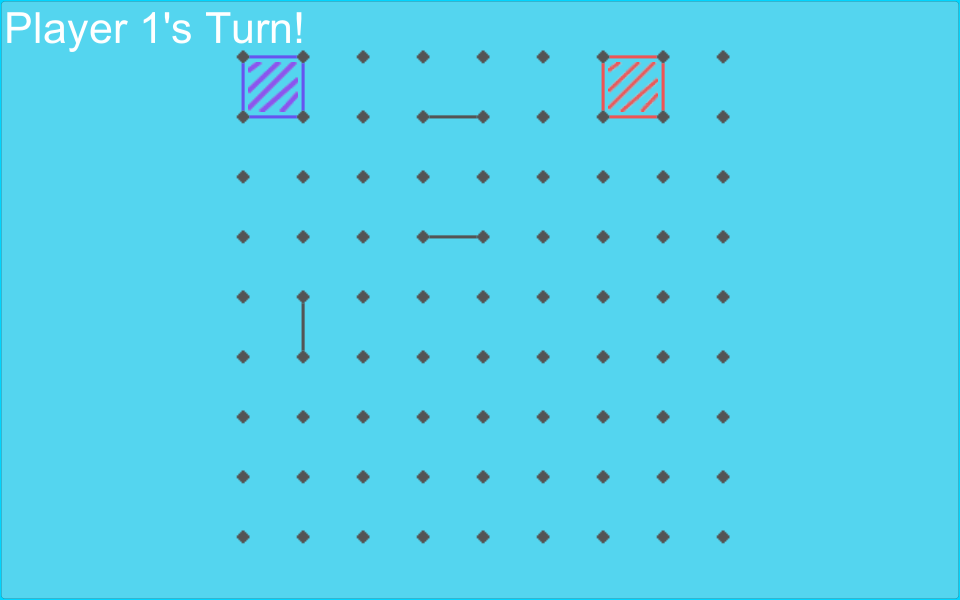

# Dots and Boxes

> Simple join the dots game that can be played with 2 players on the one device.

Created for **One Game a Month**

## Links

- [Game Page](https://wil.dev/gamejams/dots-and-boxes/)

## How to Play

Take turns clicking on lines between dots to claim them. Complete a box to score a point and earn an extra turn. The player with the most boxes at the end wins.

## Controls

| Input | Action |
|-------|--------|
| **[MOUSE]** Left Click | Join dots |

## Details

| | |
|---|---|
| Engine | Unity |
| Language | C# |
| Status | Submitted |

## Screenshots

## Downloads

See [releases](https://github.com/wiltaylor/GameJams/releases).

| Version | Download |
|---------|----------|
| v1.0.0 | [Download](https://github.com/wiltaylor/GameJams/releases/tag/DotsAndBoxes/v1.0.0) |

## Licence

See [../../LICENCE.md](../../LICENCE.md).
