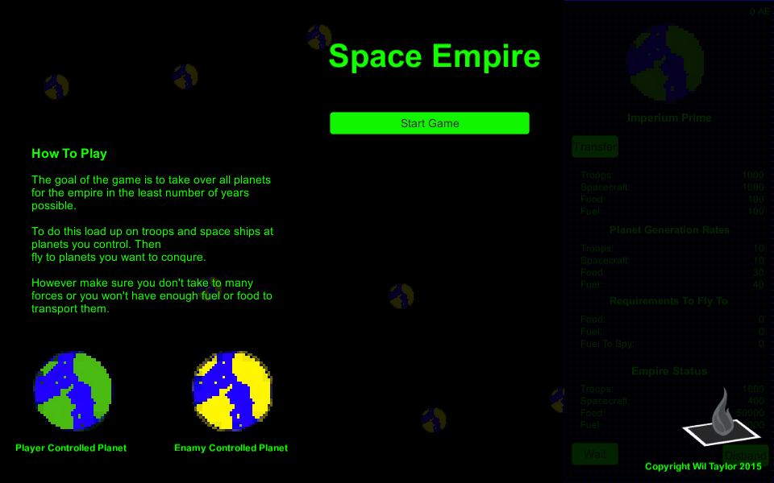

# Space Empire

> Simple strategy game where you have to take over all the planets in the galaxy.

Created for **One Game a Month**

## Links

- [Game Page](https://wil.dev/gamejams/space-empire/)
- [itch.io](https://wiltaylor.itch.io/space-empire)

## How to Play

Select planets and send fleets to conquer neighbouring worlds. Build up your forces and expand your empire across the galaxy until you control every planet.

## Controls

| Input | Action |
|-------|--------|
| **[MOUSE]** Left Click | Select planets and interact with UI |

## Details

| | |
|---|---|
| Engine | Unity |
| Language | C# |
| Platforms | Linux, Windows |
| Status | Submitted |

## Screenshots

## Downloads

See [releases](https://github.com/wiltaylor/GameJams/releases).

| Version | Download |
|---------|----------|
| v1.0.0 | [Download](https://github.com/wiltaylor/GameJams/releases/tag/SpaceEmpire/v1.0.0) |

## Licence

See [../../LICENCE.md](../../LICENCE.md).
