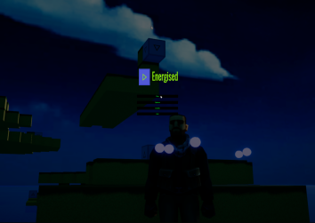
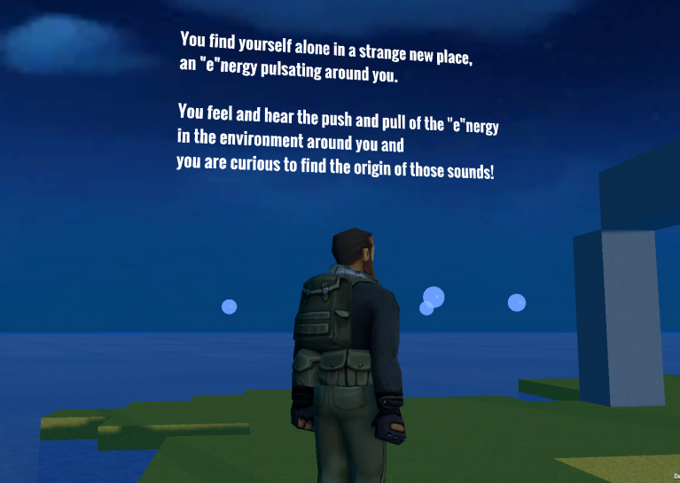

# Energized

> A game created for Global Game Jam 2018 with the theme Transmission.

Created for **Global Game Jam 2018** | Theme: *Transmission*

## Links

- [Game Page](https://wil.dev/gamejams/ggj2018/)
- [Game Jam Entry](https://v3.globalgamejam.org/2018/games/energized)

## Team

- [George Zaibak](https://v3.globalgamejam.org/users/gzbx)
- [Matt Brown - Music/SFX](https://v3.globalgamejam.org/users/mattbrownmbryo)
- [Geoffrey Newman - Art](https://v3.globalgamejam.org/users/montie68)
- [Wil Taylor - Developer](https://v3.globalgamejam.org/users/wilfrid-taylor)

## Details

| | |
|---|---|
| Engine | Unity |
| Language | C# |
| Platforms | Windows |
| Status | Submitted |

## Screenshots

## Downloads

See [releases](https://github.com/wiltaylor/GameJams/releases).

| Version | Download |
|---------|----------|
| v1.0.0 | [Download](https://github.com/wiltaylor/GameJams/releases/tag/GGJ2018/v1.0.0) |

## Licence

See [../../LICENCE.md](../../LICENCE.md).
