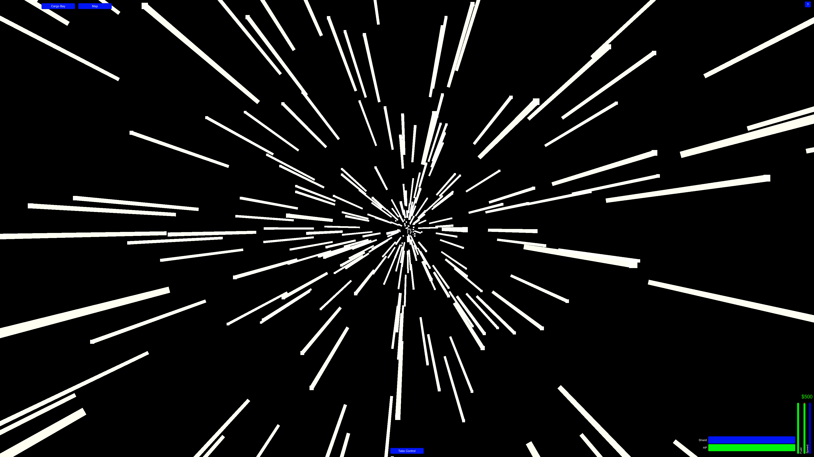
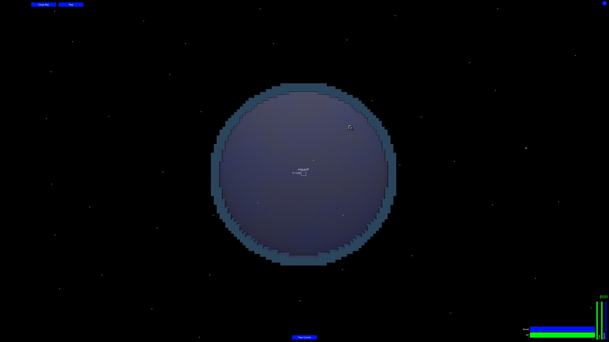
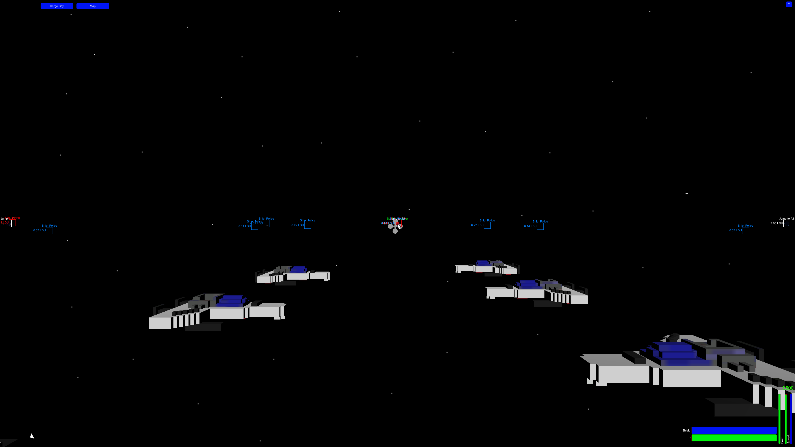
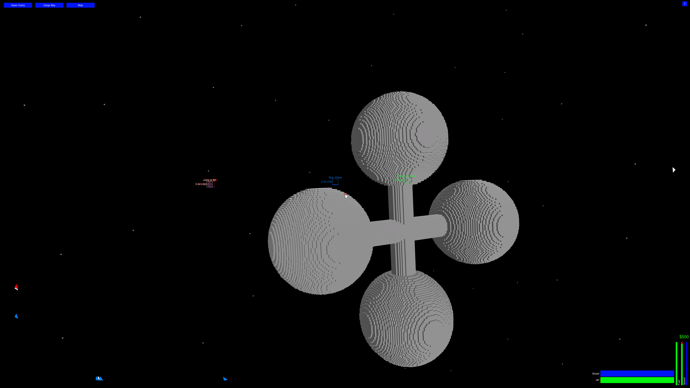
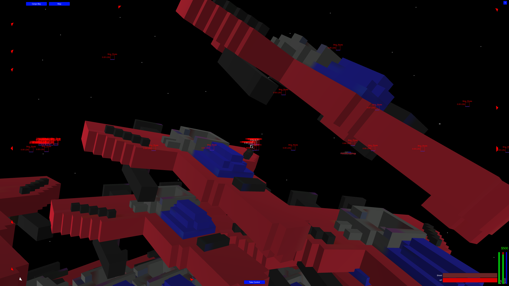

# Space Traders

> You can explore the sandbox and trade with space stations and battle pirates.

Created for **JimJam 01**

## Links

- [Game Page](https://wil.dev/gamejams/jimjam-space-traders/)
- [itch.io](https://wiltaylor.itch.io/space-trader)
- [Game Jam Entry](https://itch.io/jam/jimjam/rate/242946)

## How to Play

Fly around the galaxy trading goods between space stations to earn credits. Watch out for pirates that will attack you on sight. Use your credits to upgrade your ship.

## Controls

| Input | Action |
|-------|--------|
| **[KEYBOARD]** W / B | Accelerate and brake |
| **[KEYBOARD]** Space | Toggle ship controls |
| **[MOUSE]** Move | Control facing direction |
| **[MOUSE]** Left Click | Shoot |

## Details

| | |
|---|---|
| Engine | Unity |
| Language | C# |
| Platforms | Linux, Windows |
| Status | Submitted |

## Screenshots

## Downloads

See [releases](https://github.com/wiltaylor/GameJams/releases).

| Version | Download |
|---------|----------|
| v1.0.0 | [Download](https://github.com/wiltaylor/GameJams/releases/tag/JimJam1/v1.0.0) |

## Licence

See [../../LICENCE.md](../../LICENCE.md).
