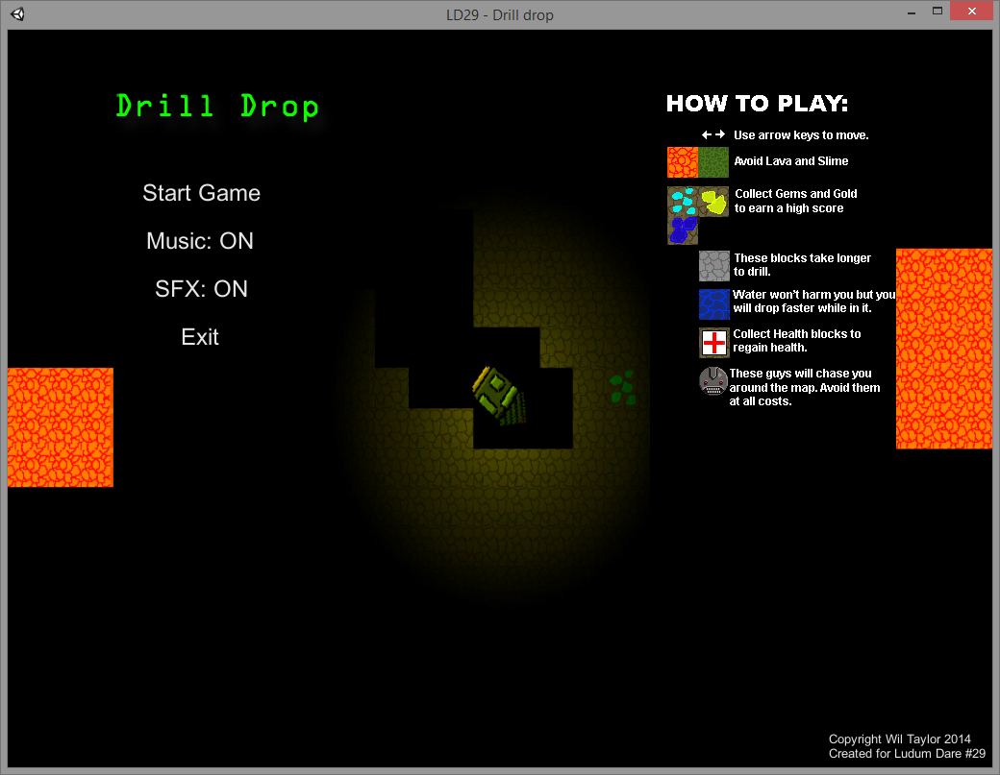
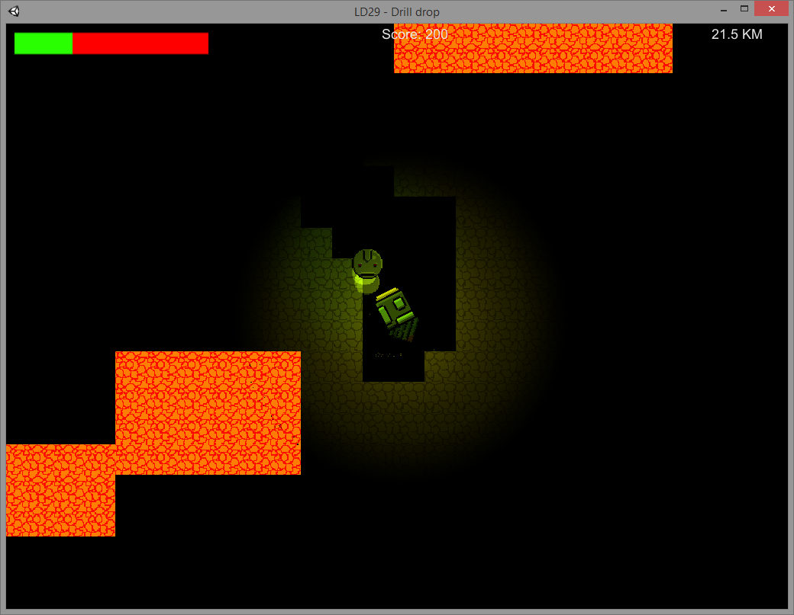
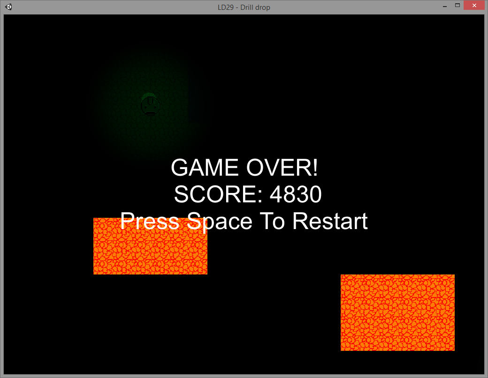

# Drill Drop

> Simple game where the goal is to drill down as far as you can collecting valuable resources to get a higher score.

Created for **Ludum Dare 29** (Compo) | Theme: *Beneath the Surface*

## Links

- [Game Page](https://wil.dev/gamejams/ld29-drill-drop/)
- [itch.io](https://wiltaylor.itch.io/drill-drop)
- [Game Jam Entry](https://web.archive.org/web/20141209190445/http://ludumdare.com/compo/ludum-dare-29/?action=preview&uid=33950)
- [Timelapse](https://www.youtube.com/watch?v=ZpyEqT1YiwU)

## How to Play

Tilt your drill left and right to navigate through the earth. Collect valuable resources as you go deeper to increase your score. Avoid obstacles that will destroy your drill.

## Controls

| Input | Action |
|-------|--------|
| **[KEYBOARD]** A / D / Left / Right | Tilt drill left or right |

## Details

| | |
|---|---|
| Engine | Unity |
| Language | C# |
| Platforms | Linux, Windows |
| Status | Submitted |

## Screenshots

## Downloads

See [releases](https://github.com/wiltaylor/GameJams/releases).

| Version | Download |
|---------|----------|
| v1.0.0 | [Download](https://github.com/wiltaylor/GameJams/releases/tag/LD29/v1.0.0) |
| v1.1.0 | [Download](https://github.com/wiltaylor/GameJams/releases/tag/LD29/v1.1.0) |
| v1.2.0 | [Download](https://github.com/wiltaylor/GameJams/releases/tag/LD29/v1.2.0) |

## Licence

See [../../LICENCE.md](../../LICENCE.md).
