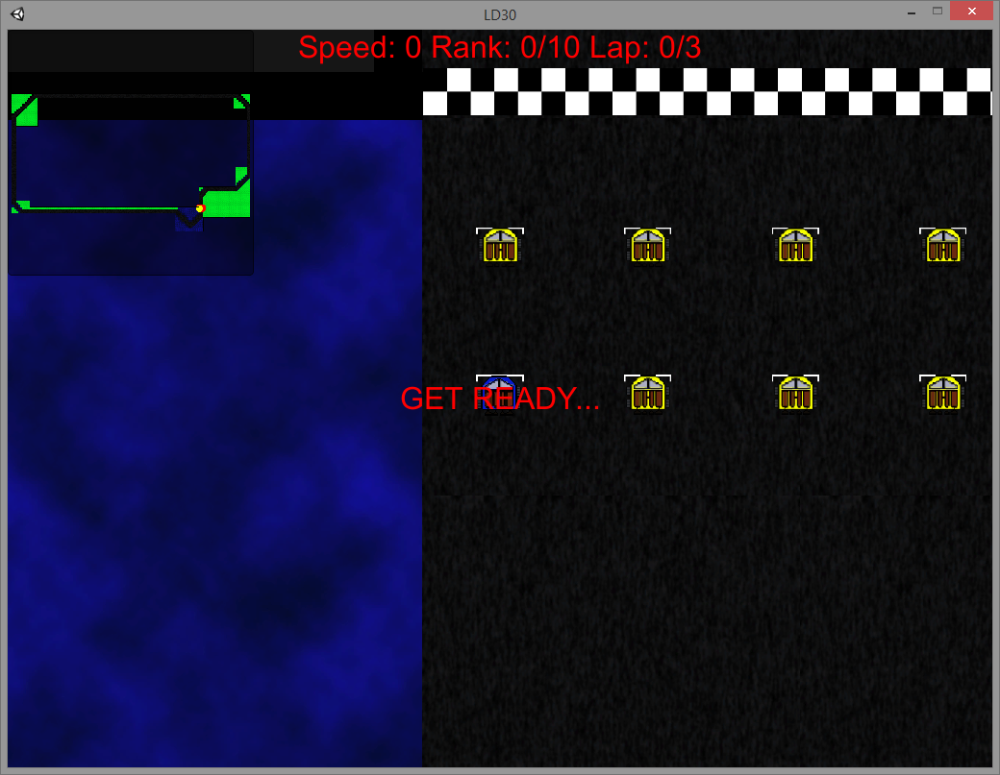
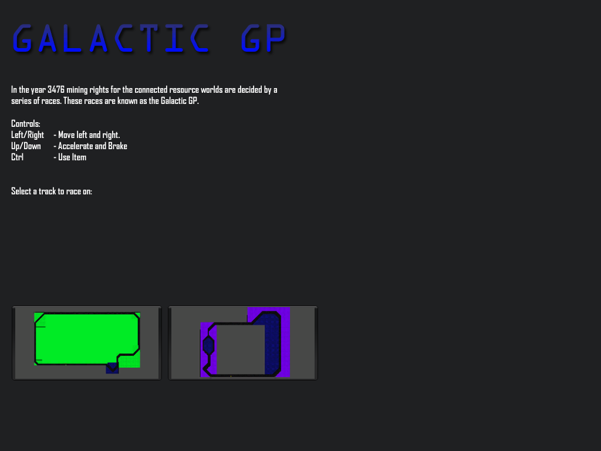
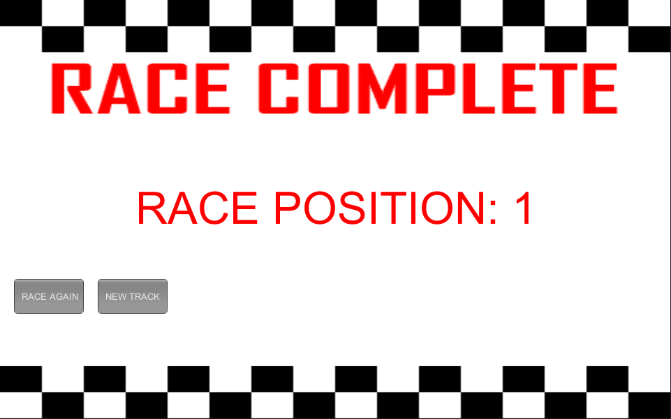

# Galactic GP

> Simple racing game where the player battles other racers to try and be the first to cross the finish line.

Created for **Ludum Dare 30** (Compo) | Theme: *Connected Worlds*

## Links

- [Game Page](https://wil.dev/gamejams/ld30-galactic-gp/)
- [itch.io](https://wiltaylor.itch.io/galactic-gp)
- [Game Jam Entry](https://web.archive.org/web/20141210090945/http://ludumdare.com/compo/ludum-dare-30/?action=preview&uid=33950)

## How to Play

Race against AI opponents across galactic tracks. Pick up items along the way to use against other racers. Be the first to cross the finish line.

## Controls

| Input | Action |
|-------|--------|
| **[KEYBOARD]** W+A+S+D / Arrow Keys | Move |
| **[KEYBOARD]** Left Ctrl | Use item |

## Details

| | |
|---|---|
| Engine | Unity |
| Language | C# |
| Platforms | Linux, Windows |
| Status | Submitted |

## Screenshots

## Downloads

See [releases](https://github.com/wiltaylor/GameJams/releases).

| Version | Download |
|---------|----------|
| v1.0.0 | [Download](https://github.com/wiltaylor/GameJams/releases/tag/LD30/v1.0.0) |
| v1.1.0 | [Download](https://github.com/wiltaylor/GameJams/releases/tag/LD30/v1.1.0) |
| v1.2.0 | [Download](https://github.com/wiltaylor/GameJams/releases/tag/LD30/v1.2.0) |

## Licence

See [../../LICENCE.md](../../LICENCE.md).
