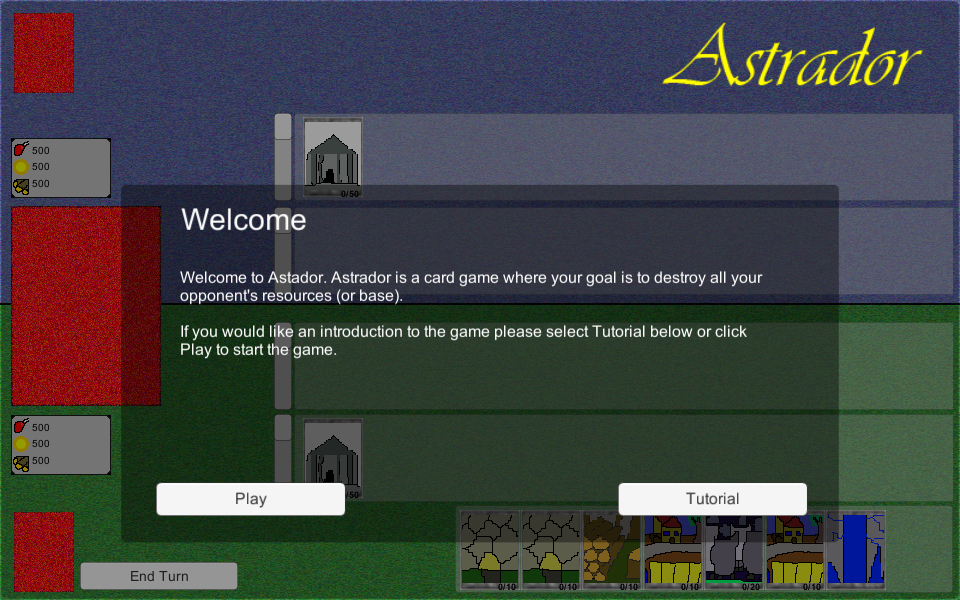
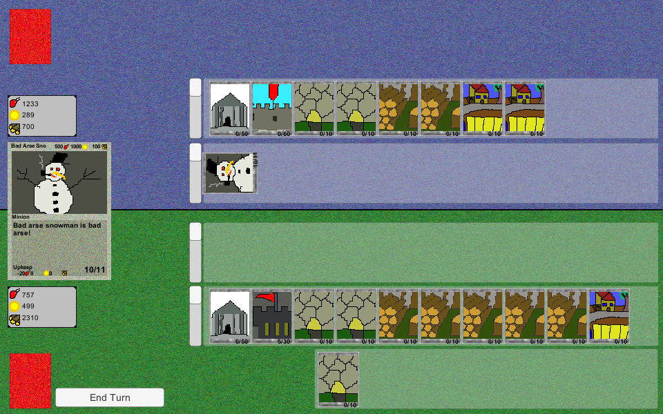
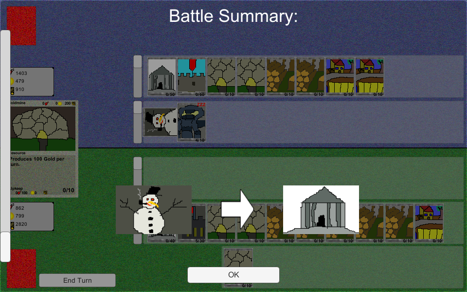

# Astrador

> Astrador is a computer based card game where you must defeat an AI player by destroying their base.

Created for **Ludum Dare 31** (Compo) | Theme: *Entire Game on One Screen*

## Links

- [Game Page](https://wil.dev/gamejams/ld31-Astrador/)
- [itch.io](https://wiltaylor.itch.io/astrador)
- [Game Jam Entry](https://web.archive.org/web/20141209163817/http://ludumdare.com/compo/ludum-dare-31/?action=preview&uid=33950)
- [Timelapse](https://www.youtube.com/watch?v=-KJNBHQvhBQ)

## How to Play

Play cards from your hand to attack the enemy base and defend your own. Each card has different abilities and costs. Reduce the enemy base health to zero to win.

## Controls

| Input | Action |
|-------|--------|
| **[MOUSE]** Drag | Move cards |
| **[MOUSE]** Left Click | Click buttons |

## Details

| | |
|---|---|
| Engine | Unity |
| Language | C# |
| Platforms | Linux, Windows |
| Status | Submitted |

## Screenshots

## Downloads

See [releases](https://github.com/wiltaylor/GameJams/releases).

| Version | Download |
|---------|----------|
| v1.0.0 | [Download](https://github.com/wiltaylor/GameJams/releases/tag/LD31/v1.0.0) |
| v1.1.0 | [Download](https://github.com/wiltaylor/GameJams/releases/tag/LD31/v1.1.0) |
| v1.2.0 | [Download](https://github.com/wiltaylor/GameJams/releases/tag/LD31/v1.2.0) |

## Licence

See [../../LICENCE.md](../../LICENCE.md).
