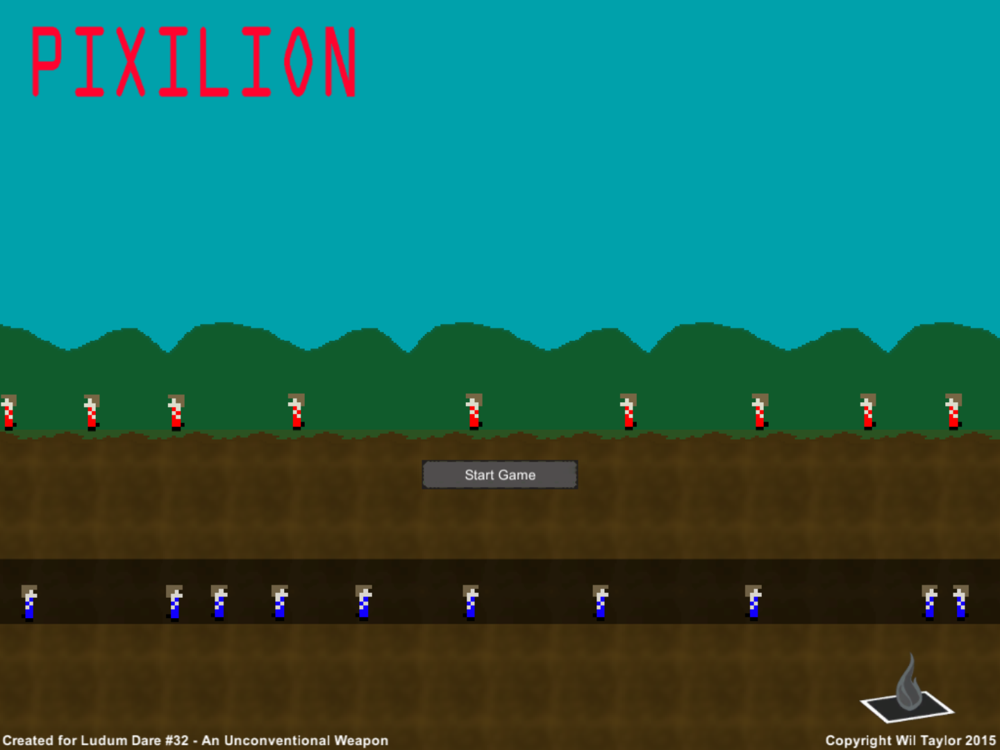
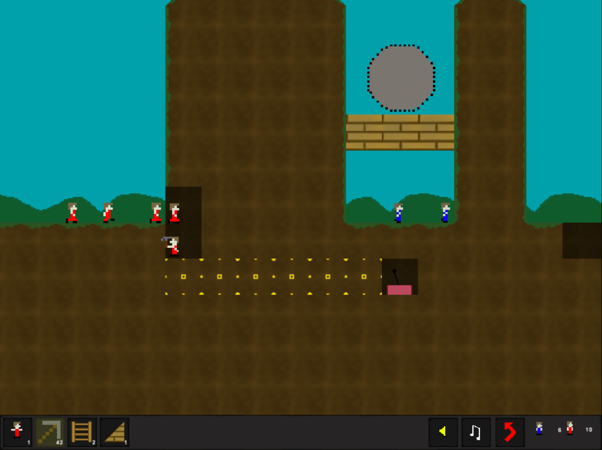
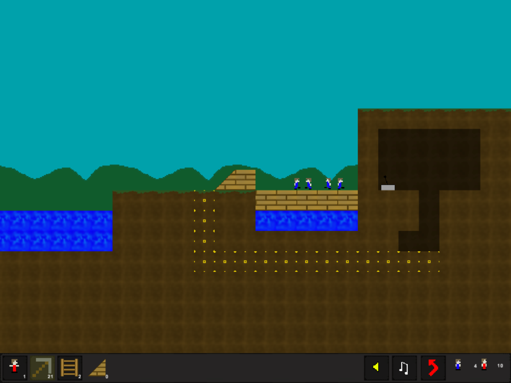

# Pixilion

> Dig and build your way to victory. While avoiding the enemy which you must destroy using means of traps and cunning.

Created for **Ludum Dare 32** (Compo) | Theme: *An Unconventional Weapon*

## Links

- [Game Page](https://wil.dev/gamejams/ld32-pixilion/)
- [itch.io](https://wiltaylor.itch.io/pixilion)
- [Game Jam Entry](https://web.archive.org/web/20170920054625/http://ludumdare.com/compo/ludum-dare-32/?action=preview&uid=33950)
- [Timelapse](https://www.youtube.com/watch?v=T8hosNMxeeI)

## How to Play

Select units and give them orders to dig, build, and fight. Use the mouse wheel to zoom in and out. Items and their usage are explained in the tutorial levels.

## Controls

| Input | Action |
|-------|--------|
| **[KEYBOARD]** W+A+S+D / Arrow Keys | Move around level |
| **[MOUSE]** Left Click | Select units |
| **[MOUSE]** Left Click | Give units orders |

## Details

| | |
|---|---|
| Engine | Unity |
| Language | C# |
| Platforms | Web, Linux, Windows |
| Status | Submitted |

## Screenshots

## Downloads

See [releases](https://github.com/wiltaylor/GameJams/releases).

| Version | Download |
|---------|----------|
| v1.0.0 | [Download](https://github.com/wiltaylor/GameJams/releases/tag/LD32/v1.0.0) |
| v1.1.0 | [Download](https://github.com/wiltaylor/GameJams/releases/tag/LD32/v1.1.0) |

## Licence

See [../../LICENCE.md](../../LICENCE.md).
