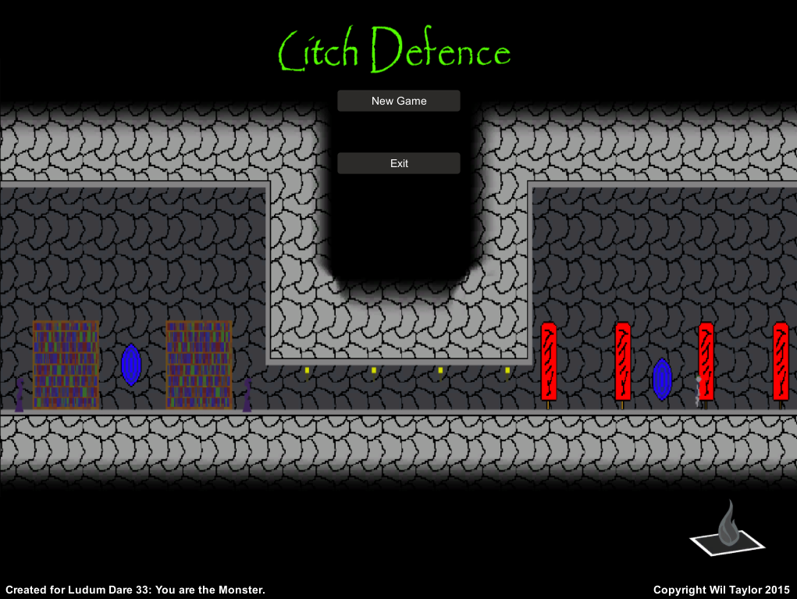
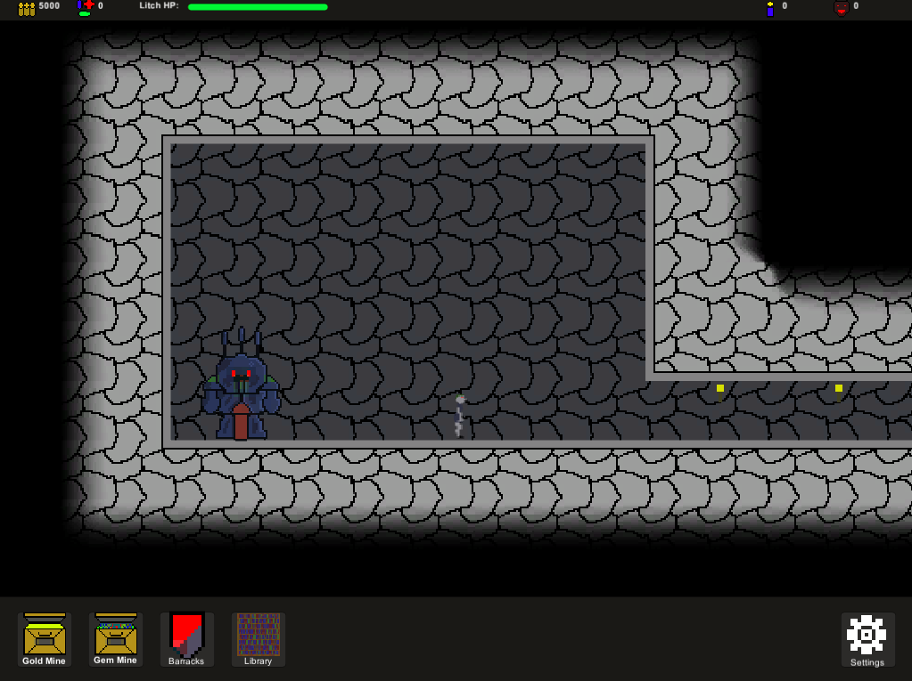
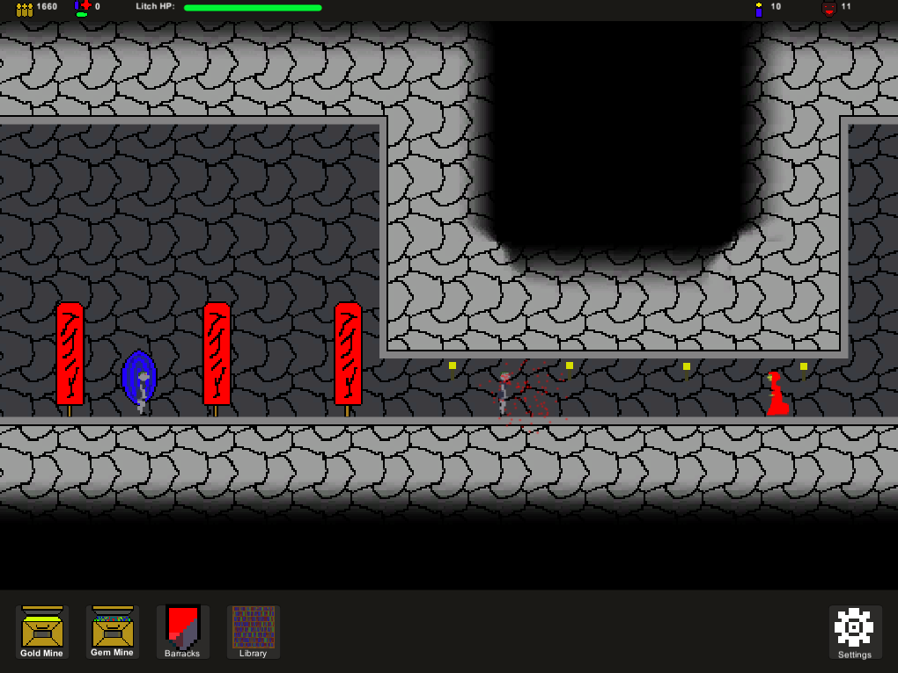

# Litch Defence

> You play as a Litch who has to fight off waves of heroes who keep invading your dungeon. To defend yourself you can build extra rooms in your dungeon and command an army of minions.

Created for **Ludum Dare 33** (Compo) | Theme: *You are the Monster*

## Links

- [Game Page](https://wil.dev/gamejams/ld33-litch-defence/)
- [itch.io](https://wiltaylor.itch.io/litch-defence)
- [Game Jam Entry](https://web.archive.org/web/20171129111400/http://ludumdare.com/compo/ludum-dare-33/?action=preview&uid=33950)
- [Timelapse](https://www.youtube.com/watch?v=UPzHfSxv7J8)

## How to Play

Build rooms in your dungeon to spawn minions and set up defences. Heroes will invade in waves - use your minions and dungeon layout to defeat them. Survive as many waves as possible.

## Controls

| Input | Action |
|-------|--------|
| **[KEYBOARD]** Arrow Keys | Move screen |
| **[MOUSE]** Left Click | Build rooms |

## Details

| | |
|---|---|
| Engine | Unity |
| Language | C# |
| Platforms | Web, Linux, Windows |
| Status | Submitted |

## Screenshots

## Downloads

See [releases](https://github.com/wiltaylor/GameJams/releases).

| Version | Download |
|---------|----------|
| v1.0.0 | [Download](https://github.com/wiltaylor/GameJams/releases/tag/LD33/v1.0.0) |
| v1.1.0 | [Download](https://github.com/wiltaylor/GameJams/releases/tag/LD33/v1.1.0) |

## Licence

See [../../LICENCE.md](../../LICENCE.md).
