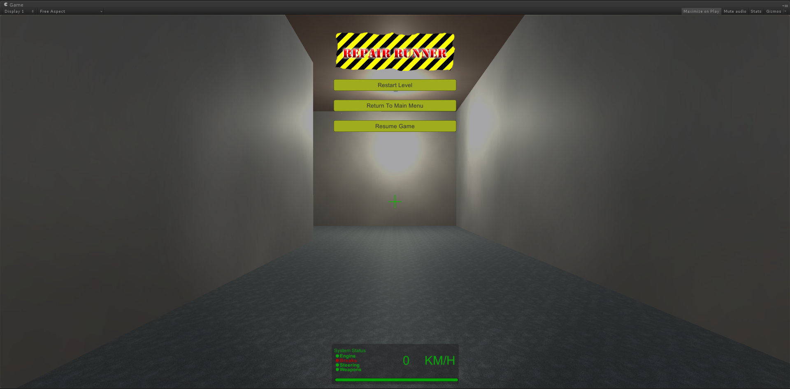
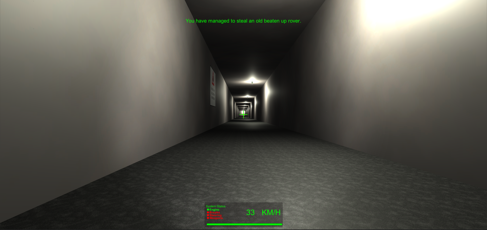
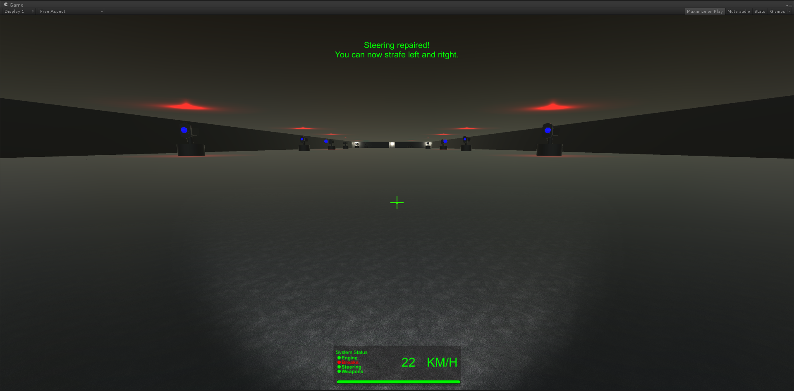
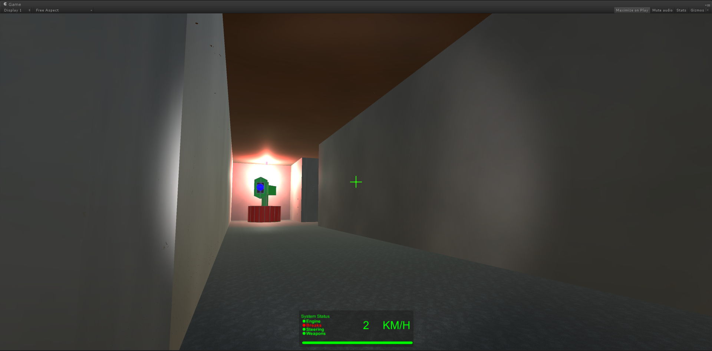

# Repair Runner

> You have escaped from a cell and need to get back to the surface to flee the base.

Created for **Ludum Dare 34** (Compo) | Theme: *Two Button Controls / Growing*

## Links

- [Game Page](https://wil.dev/gamejams/ld34-repair-runner/)
- [itch.io](https://wiltaylor.itch.io/repair-runner)
- [Game Jam Entry](https://web.archive.org/web/20170919103540/http://ludumdare.com/compo/ludum-dare-34/?action=preview&uid=33950)
- [Timelapse](https://www.youtube.com/watch?v=YYppnxfuMlA)

## How to Play

Navigate through the base, fighting enemies and finding your way to the exit. Repair your rover's systems as you progress to unlock new abilities.

## Controls

| Input | Action |
|-------|--------|
| **[KEYBOARD]** W+A+S+D / Arrow Keys | Move |
| **[KEYBOARD]** Left Ctrl | Shoot |
| **[KEYBOARD]** Escape | Menu |
| **[MOUSE]** Move | Look around |

## Details

| | |
|---|---|
| Engine | Unity |
| Language | C# |
| Platforms | Linux, Windows |
| Status | Submitted |

## Screenshots

## Downloads

See [releases](https://github.com/wiltaylor/GameJams/releases).

| Version | Download |
|---------|----------|
| v1.0.0 | [Download](https://github.com/wiltaylor/GameJams/releases/tag/LD34/v1.0.0) |
| v1.1.0 | [Download](https://github.com/wiltaylor/GameJams/releases/tag/LD34/v1.1.0) |
| v1.2.0 | [Download](https://github.com/wiltaylor/GameJams/releases/tag/LD34/v1.2.0) |

## Licence

See [../../LICENCE.md](../../LICENCE.md).
