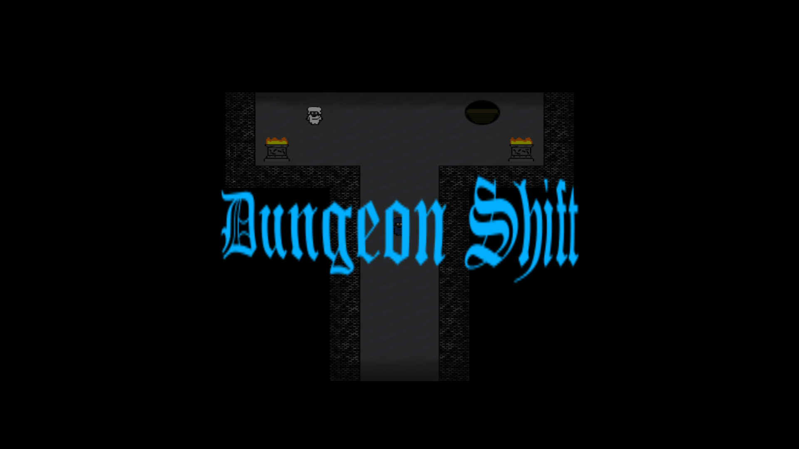
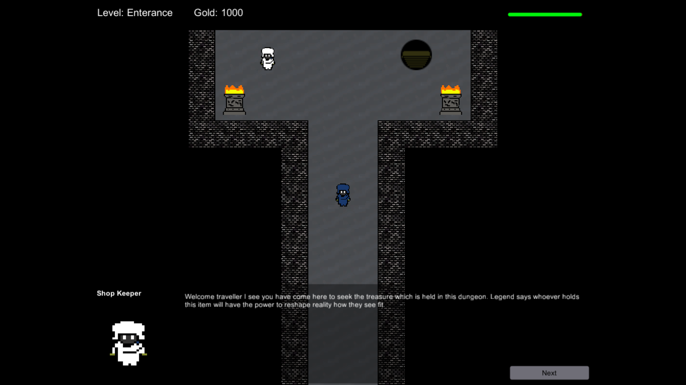
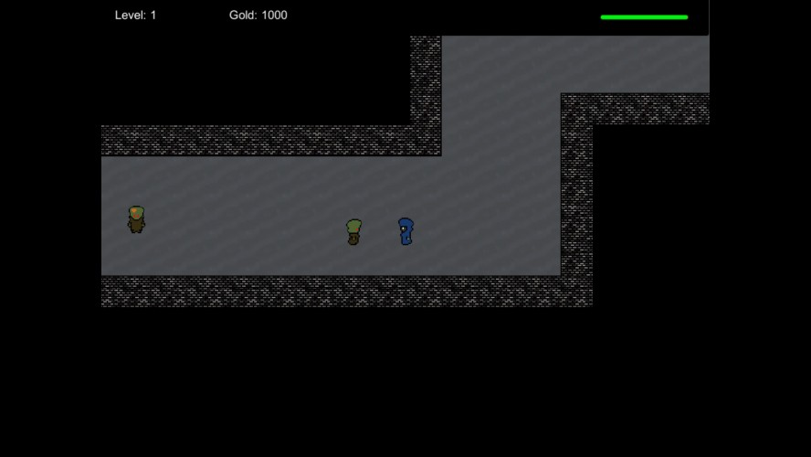
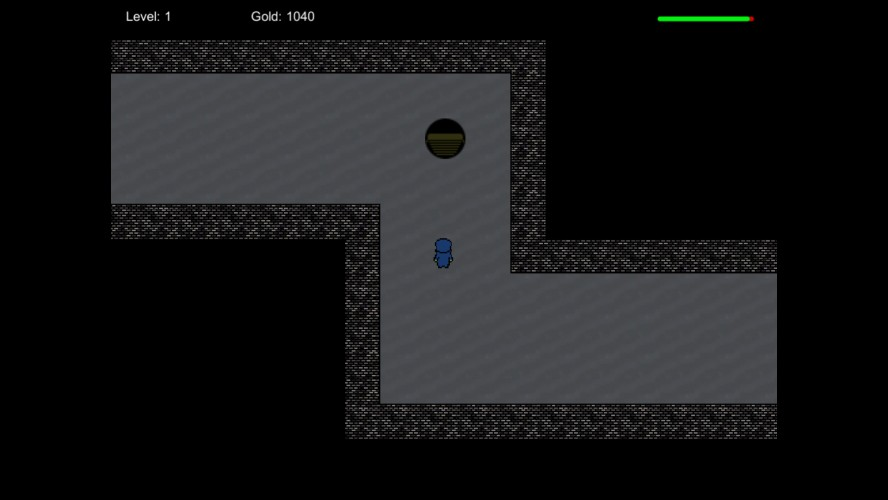

# Dungeon Shift

> A simple dungeon crawler with randomized dungeons.

Created for **Ludum Dare 35** (Compo) | Theme: *Shapeshift*

## Links

- [Game Page](https://wil.dev/gamejams/ld35-sungeon-shift/)
- [itch.io](https://wiltaylor.itch.io/dungeon-shift)
- [Game Jam Entry](https://web.archive.org/web/20210124195156/http://ludumdare.com/compo/ludum-dare-35/?action=preview&uid=33950)

## How to Play

Explore procedurally generated dungeons, fighting enemies and collecting loot. Find the exit on each floor to progress deeper. Use items and attack to survive.

## Controls

| Input | Action |
|-------|--------|
| **[KEYBOARD]** Arrow Keys | Move |
| **[KEYBOARD]** Left Alt | Use |
| **[KEYBOARD]** Left Ctrl | Attack |
| **[KEYBOARD]** Escape | Menu |

## Details

| | |
|---|---|
| Engine | Unity |
| Language | C# |
| Platforms | Linux, Windows |
| Status | Submitted |

## Screenshots

## Downloads

See [releases](https://github.com/wiltaylor/GameJams/releases).

| Version | Download |
|---------|----------|
| v1.0.0 | [Download](https://github.com/wiltaylor/GameJams/releases/tag/LD35/v1.0.0) |
| v1.1.0 | [Download](https://github.com/wiltaylor/GameJams/releases/tag/LD35/v1.1.0) |

## Licence

See [../../LICENCE.md](../../LICENCE.md).
