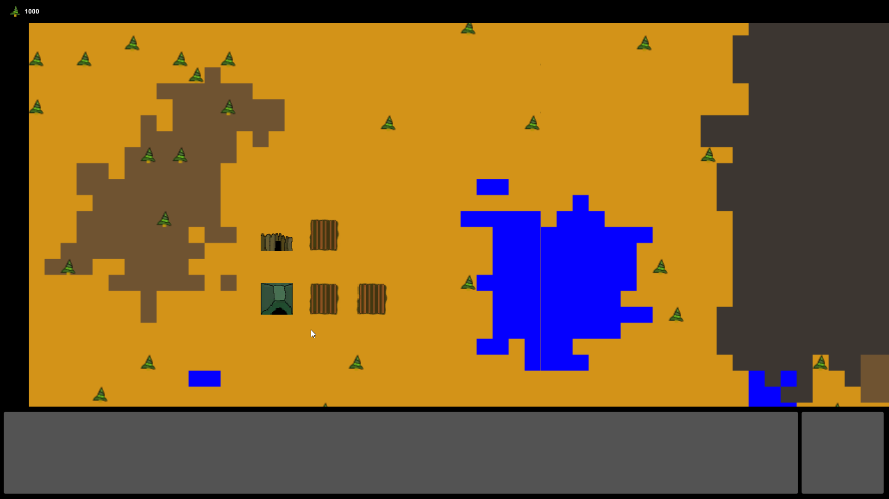
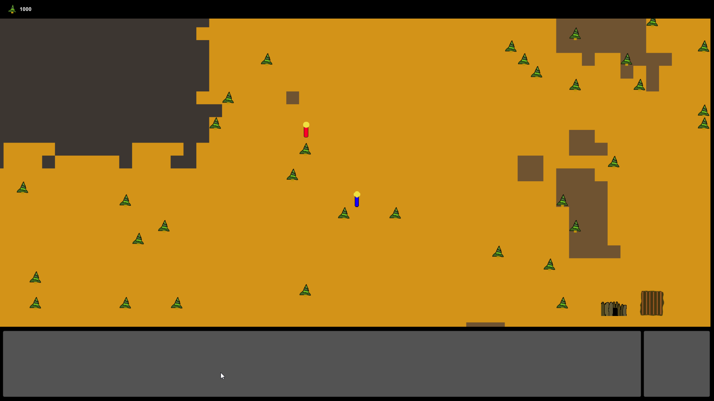

# RTS

> Failed rts game I didn't finish for Ludum Dare 36.

Created for **Ludum Dare 36** (Compo) | Theme: *Ancient Technology*

## Links

- [Game Page](https://wil.dev/gamejams/ld36-rts/)

## Controls

| Input | Action |
|-------|--------|
| **[MOUSE]** Left Click | Select units |
| **[MOUSE]** Right Click | Issue orders |
| **[MOUSE]** Screen Edge | Move around battlefield |

## Details

| | |
|---|---|
| Engine | Unity |
| Language | C# |
| Platforms | Web |
| Status | Failed |

## Screenshots

## Downloads

See [releases](https://github.com/wiltaylor/GameJams/releases).

| Version | Download |
|---------|----------|
| v1.0.0 | [Download](https://github.com/wiltaylor/GameJams/releases/tag/LD36/v1.0.0) |
| v1.1.0 | [Download](https://github.com/wiltaylor/GameJams/releases/tag/LD36/v1.1.0) |

## Licence

See [../../LICENCE.md](../../LICENCE.md).
