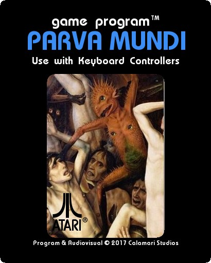
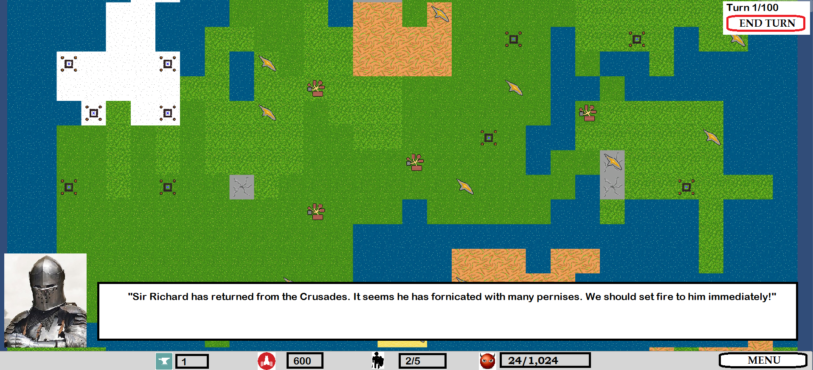
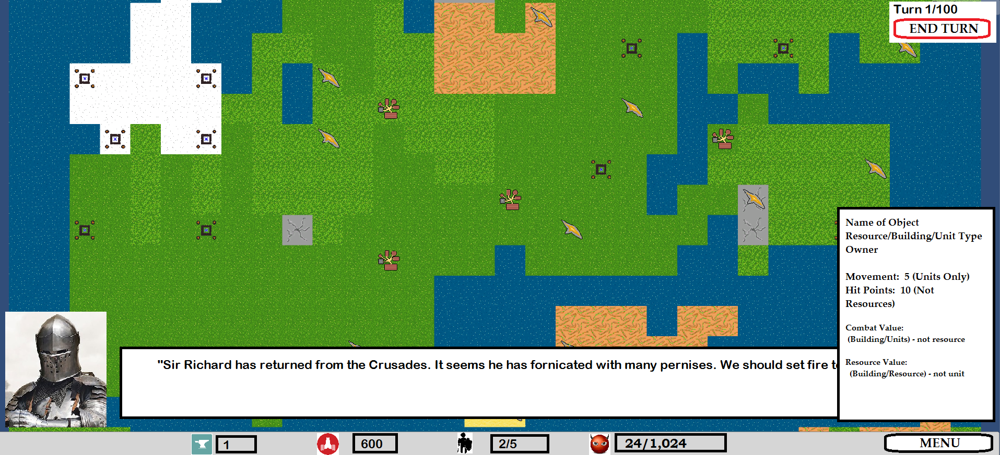

# Parva Mundi

> A strategy game set during the apocalypse. Mount a crusade against nearby cities, convert them to your faith, and fight off demons crawling from Hell.

Created for **Ludum Dare 38** (Jam) | Theme: *A Small World*

## Links

- [Game Page](https://wil.dev/gamejams/ld38-crusade/)
- [Game Jam Entry](https://ldjam.com/events/ludum-dare/38/purva-mundi)

## Team

- [Wil Taylor - Developer](https://ldjam.com/users/sirikan)
- [MasterTwig - Art](https://ldjam.com/users/mastertwig)
- [PastryProducts - Designer](https://ldjam.com/users/pastryproducts)

## How to Play

Build units from your cities and use them to convert nearby cities to your faith. Workers can build mines (for iron) and shrines (for faith). Watch out for demons spawning from Hell Portals - send a unit in to destroy them at a cost. Convert enough cities and your faith will banish the demons from the land.

**Unit Types:**
- **Scout** - Fast unit for scouting the countryside
- **Worker** - One-use unit that builds mines and shrines
- **Spear Man** - Basic military unit when iron is scarce
- **Knight** - The most powerful military unit
- **Cleric** - Can heal nearby units, convert cities, or destroy demons
- **Demons** - Three types that devour souls and drag cities to Hell

## Controls

| Input | Action |
|-------|--------|
| **[KEYBOARD]** Arrow Keys | Move camera |
| **[KEYBOARD]** Space | Skip in-game dialog |
| **[KEYBOARD]** Enter | End Turn |
| **[MOUSE]** Left Click | Select Unit/Building, Build or Construct |
| **[MOUSE]** Right Click | Move selected unit and attack |

## Details

| | |
|---|---|
| Engine | Unity |
| Language | C# |
| Status | Submitted |

## Screenshots

## Downloads

See [releases](https://github.com/wiltaylor/GameJams/releases).

| Version | Download |
|---------|----------|
| v1.0.0 | [Download](https://github.com/wiltaylor/GameJams/releases/tag/LD38/v1.0.0) |
| v1.1.0 | [Download](https://github.com/wiltaylor/GameJams/releases/tag/LD38/v1.1.0) |

## Licence

See [../../LICENCE.md](../../LICENCE.md).
