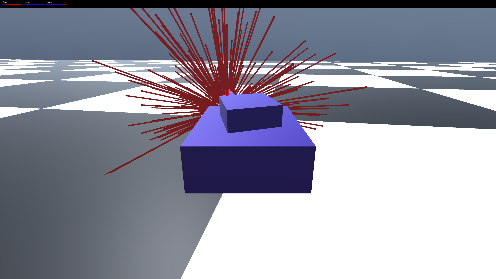
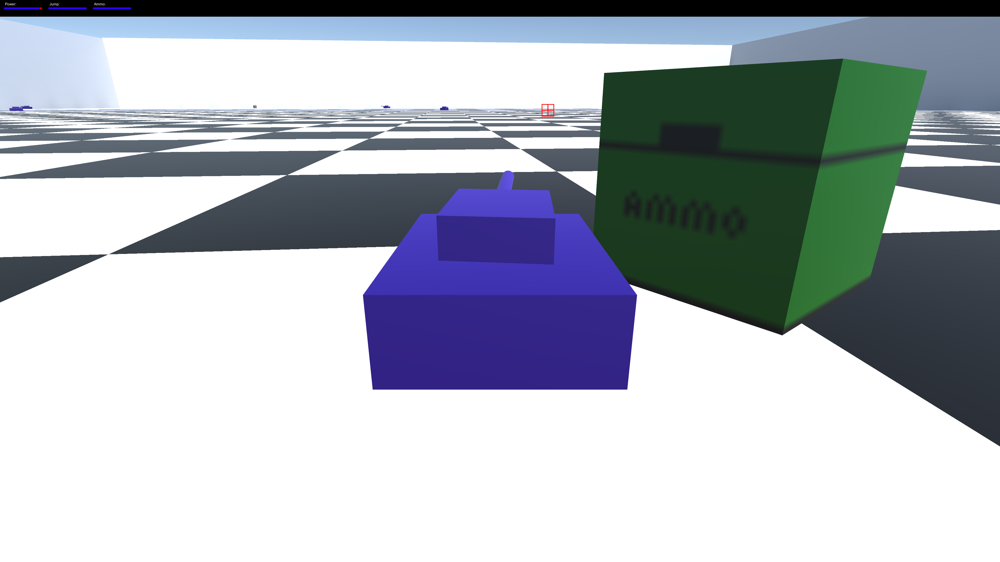
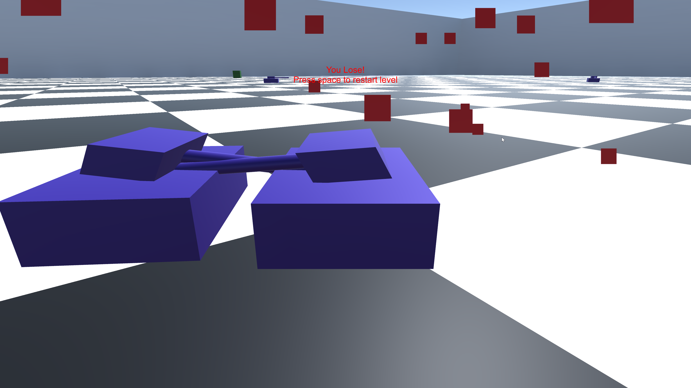

# Power Tank

> Tank game where you have to drive around an arena battle royal style taking out all the other tanks. Many tanks enter but only one will leave.

Created for **Ludum Dare 39** (Compo) | Theme: *Running out of Power*

## Links

- [Game Page](https://wil.dev/gamejams/ld39-power-out/)
- [Game Jam Entry](https://ldjam.com/events/ludum-dare/39/power-tank)

## How to Play

Drive your tank around the arena and destroy all other tanks. Last tank standing wins. Watch your power levels - running out of power means game over.

## Details

| | |
|---|---|
| Engine | Unity |
| Language | C# |
| Platforms | Linux, Windows |
| Status | Submitted |

## Screenshots

## Downloads

See [releases](https://github.com/wiltaylor/GameJams/releases).

| Version | Download |
|---------|----------|
| v1.0.0 | [Download](https://github.com/wiltaylor/GameJams/releases/tag/LD39/v1.0.0) |
| v1.1.0 | [Download](https://github.com/wiltaylor/GameJams/releases/tag/LD39/v1.1.0) |

## Licence

See [../../LICENCE.md](../../LICENCE.md).
