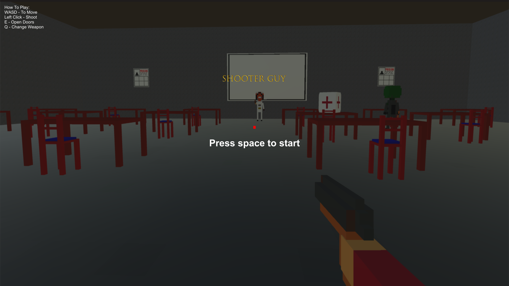
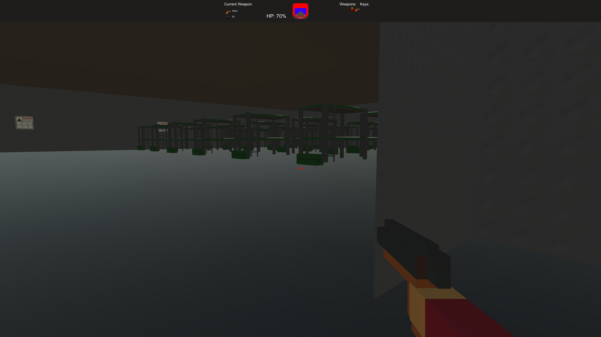
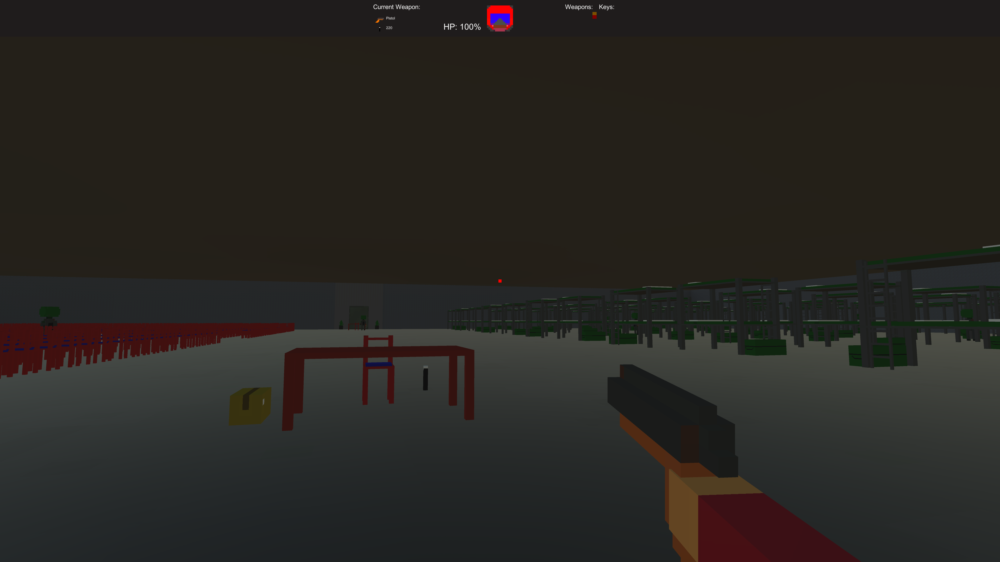
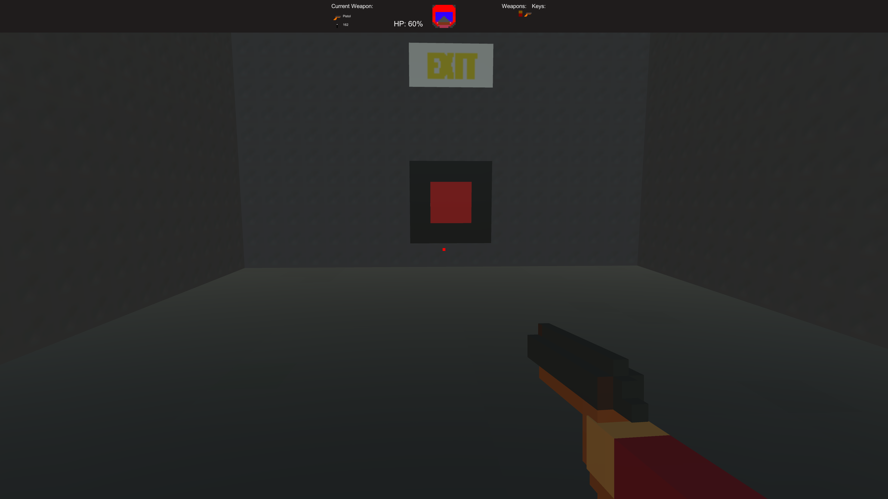
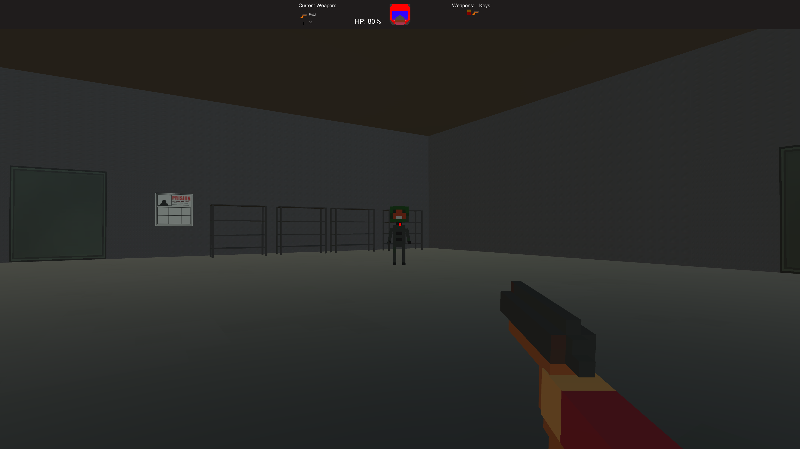

# Shooter Guy

> This is a simple voxel styled FPS I created for Ludum Dare 40.

Created for **Ludum Dare 40** (Compo) | Theme: *The more you have, the worse it is*

## Links

- [Game Page](https://wil.dev/gamejams/ld40-shooter-guy/)
- [itch.io](https://wiltaylor.itch.io/ld40-shooter-guy)
- [Game Jam Entry](https://ldjam.com/events/ludum-dare/40/shooter-guy)
- [Timelapse](https://www.youtube.com/watch?v=eu-rfDb8c3o)

## How to Play

Fight through voxel levels, defeating enemies to reach the exit. Switch between weapons to deal with different threats. Find and use interactive objects to progress.

## Controls

| Input | Action |
|-------|--------|
| **[KEYBOARD]** W+A+S+D / Arrow Keys | Move |
| **[KEYBOARD]** E | Use |
| **[KEYBOARD]** Q | Change Weapon |
| **[MOUSE]** Move | Look around |
| **[MOUSE]** Left Click | Shoot |

## Details

| | |
|---|---|
| Engine | Unity |
| Language | C# |
| Platforms | Linux, Windows |
| Status | Submitted |

## Screenshots

## Downloads

See [releases](https://github.com/wiltaylor/GameJams/releases).

| Version | Download |
|---------|----------|
| v1.0.0 | [Download](https://github.com/wiltaylor/GameJams/releases/tag/LD40/v1.0.0) |

## Licence

See [../../LICENCE.md](../../LICENCE.md).
