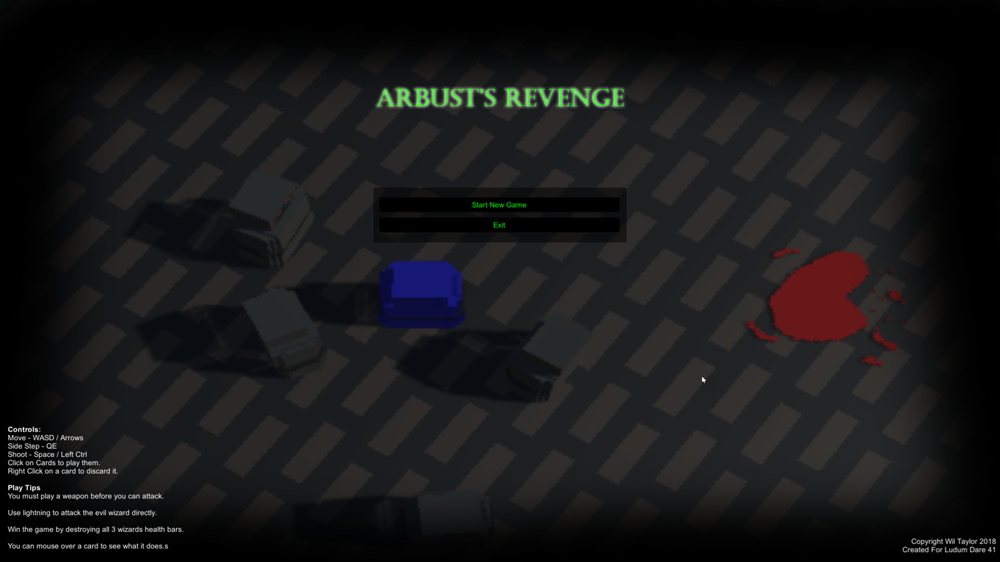
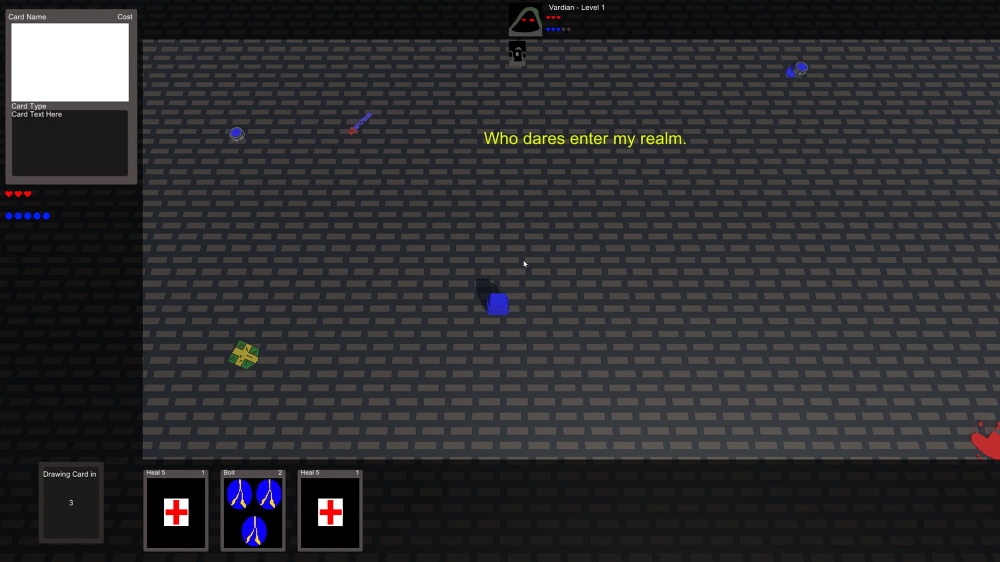
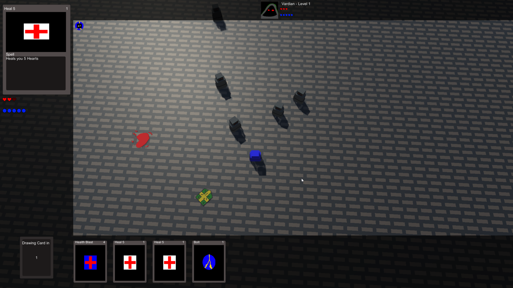
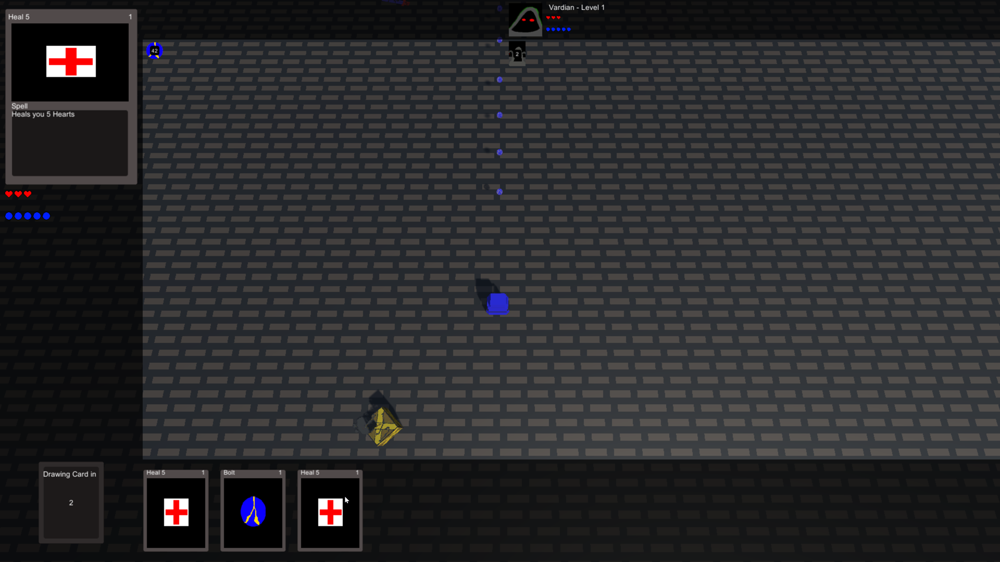
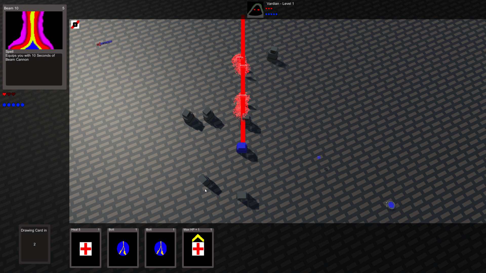

# Arbusts Revenge

> Do you have what it takes to destroy the evil Arbust and his fellow wizards?

Created for **Ludum Dare 41** (Compo) | Theme: *Combine 2 Incompatible Genres*

## Links

- [Game Page](https://wil.dev/gamejams/ld41-arbusts-revenge/)
- [itch.io](https://wiltaylor.itch.io/arbusts-revenge)
- [Game Jam Entry](https://ldjam.com/events/ludum-dare/41/arbusts-revenge)
- [Timelapse](https://www.youtube.com/watch?v=SxzyXA7U0FY)

## How to Play

Navigate the arena in first person while simultaneously managing a card game. Play cards to attack Arbust and discard ones you don't need. Defeat his minions in the arena and reduce his health through cards to win.

## Controls

| Input | Action |
|-------|--------|
| **[KEYBOARD]** W+A+S+D / Arrow Keys | Move |
| **[KEYBOARD]** Q / E | Side step |
| **[MOUSE]** Left Click | Play card |
| **[MOUSE]** Right Click | Discard card |

## Details

| | |
|---|---|
| Engine | Unity |
| Language | C# |
| Platforms | Linux, Windows |
| Status | Submitted |

## Screenshots

## Downloads

See [releases](https://github.com/wiltaylor/GameJams/releases).

| Version | Download |
|---------|----------|
| v1.0.0 | [Download](https://github.com/wiltaylor/GameJams/releases/tag/LD41/v1.0.0) |

## Licence

See [../../LICENCE.md](../../LICENCE.md).
