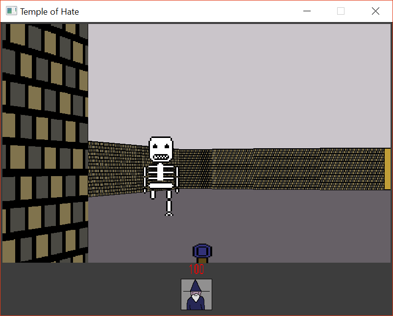
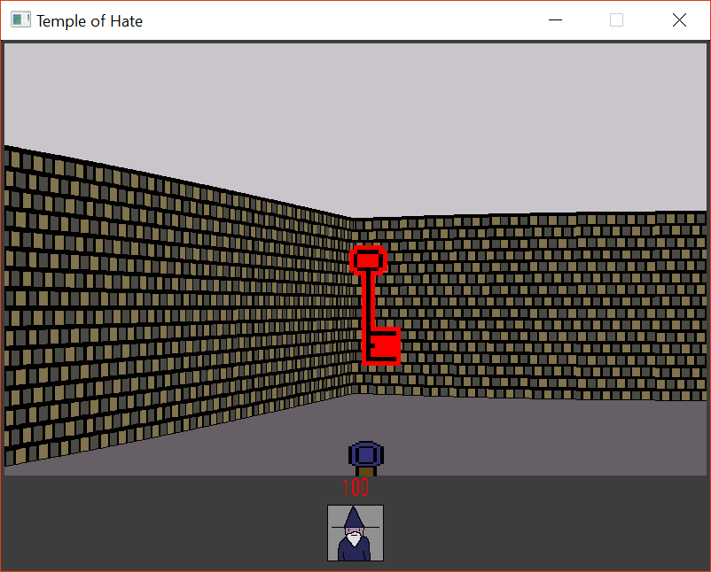
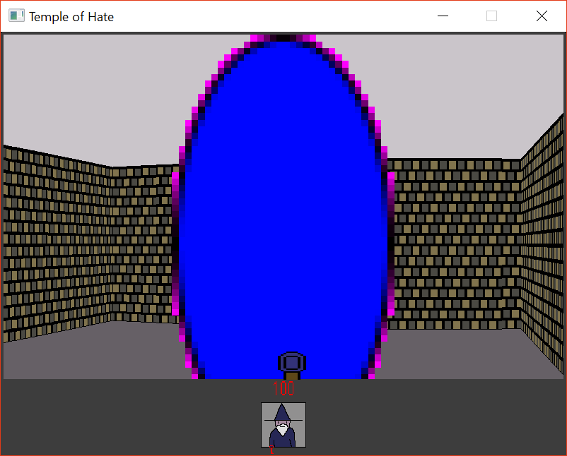

# Temple of Hate

> You have been captured and put in a cell inside the Template of hate. You must wake up and get out of this place.

Created for **Ludum Dare 42** (Compo) | Theme: *Running out of Space*

## Links

- [Game Page](https://wil.dev/gamejams/ld42-temple-of-hate/)
- [itch.io](https://wiltaylor.itch.io/temple-of-hate)
- [Game Jam Entry](https://ldjam.com/events/ludum-dare/42/temple-of-hate)
- [Timelapse](https://www.youtube.com/watch?v=K6PQN0HzfAk)

## How to Play

Explore the temple, find keys to unlock doors, and fight enemies. Find the exit to escape. Use doors and interact with objects to progress through the temple.

## Controls

| Input | Action |
|-------|--------|
| **[KEYBOARD]** Arrow Keys | Move |
| **[KEYBOARD]** Ctrl | Shoot |
| **[KEYBOARD]** Space | Use/Open |

## Details

| | |
|---|---|
| Engine | Custom |
| Language | C++ |
| Platforms | Web, Linux, Windows |
| Status | Submitted |

## Screenshots

## Downloads

See [releases](https://github.com/wiltaylor/GameJams/releases).

| Version | Download |
|---------|----------|
| v1.0.0 | [Download](https://github.com/wiltaylor/GameJams/releases/tag/LD42/v1.0.0) |

## Licence

See [../../LICENCE.md](../../LICENCE.md).
