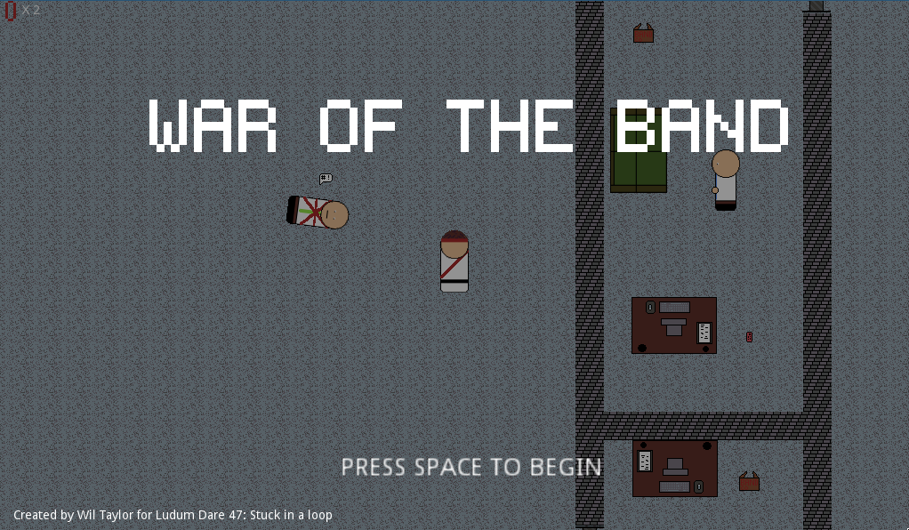
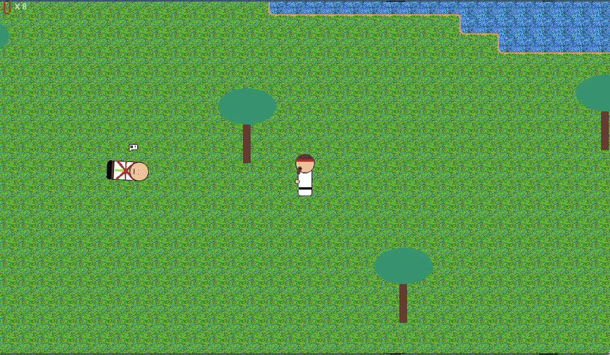
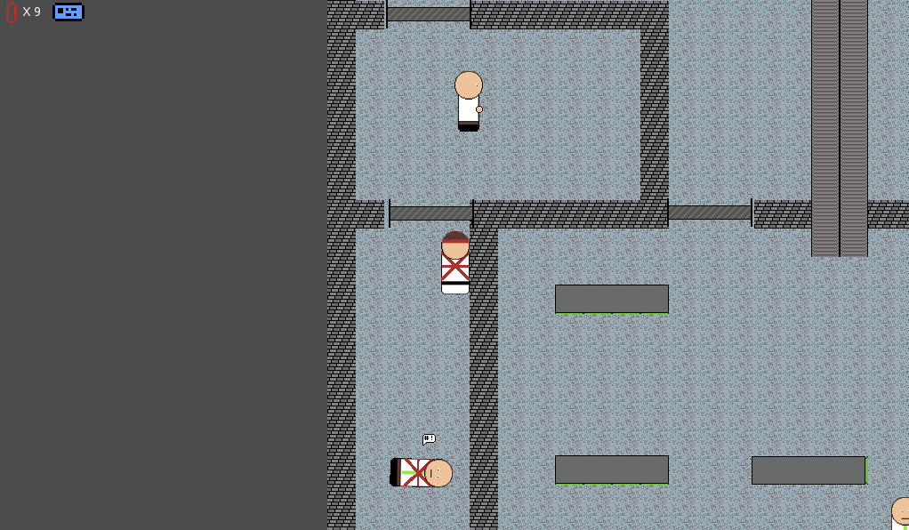
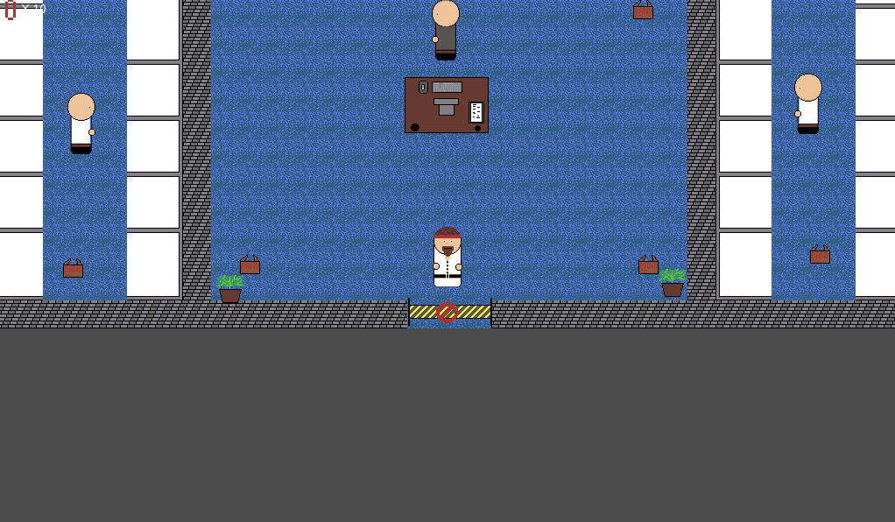

# War of the band

> You are stuck in an endless war to control Band Co the worlds best elastic band company. Will you be the one to keep control of this company or will you be just another one in the end less loop of take overs.

Created for **Ludum Dare 47** (Compo) | Theme: *Stuck in a loop*

## Links

- [Game Page](https://wil.dev/gamejams/ld47-war-of-band/)
- [itch.io](https://wiltaylor.itch.io/war-of-the-band)
- [Game Jam Entry](https://ldjam.com/events/ludum-dare/47/war-of-the-band)
- [Timelapse](https://www.youtube.com/watch?v=gg6Q0-8S5-c)

## How to Play

Shoot enemies with elastic bands while avoiding being hit yourself. Be careful with your ammo supply and pick up more ammo from boxes around the level. Built as a ray casting FPS in Godot.

## Controls

| Input | Action |
|-------|--------|
| **[KEYBOARD]** Arrow Keys | Move |
| **[KEYBOARD]** Ctrl | Shoot |
| **[KEYBOARD]** Alt | Use/Open |

## Details

| | |
|---|---|
| Engine | Godot |
| Language | GDScript |
| Platforms | Web |
| Status | Submitted |

## Screenshots

## Licence

See [../../LICENCE.md](../../LICENCE.md).
