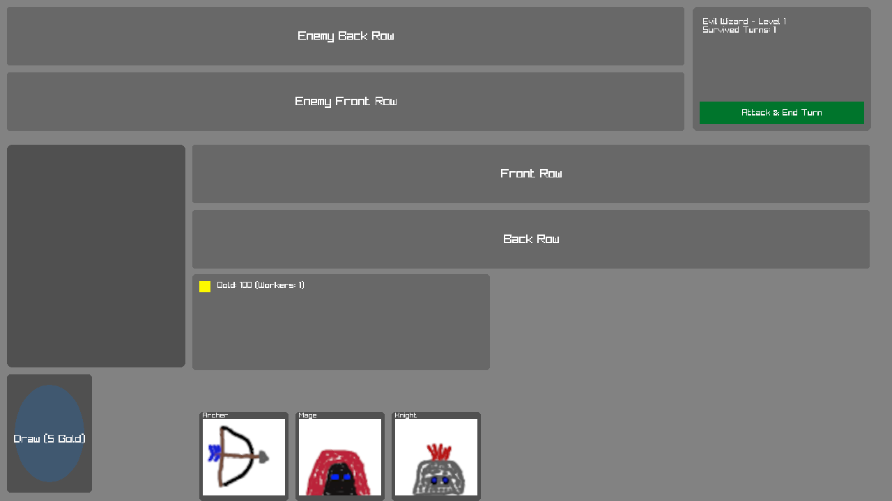
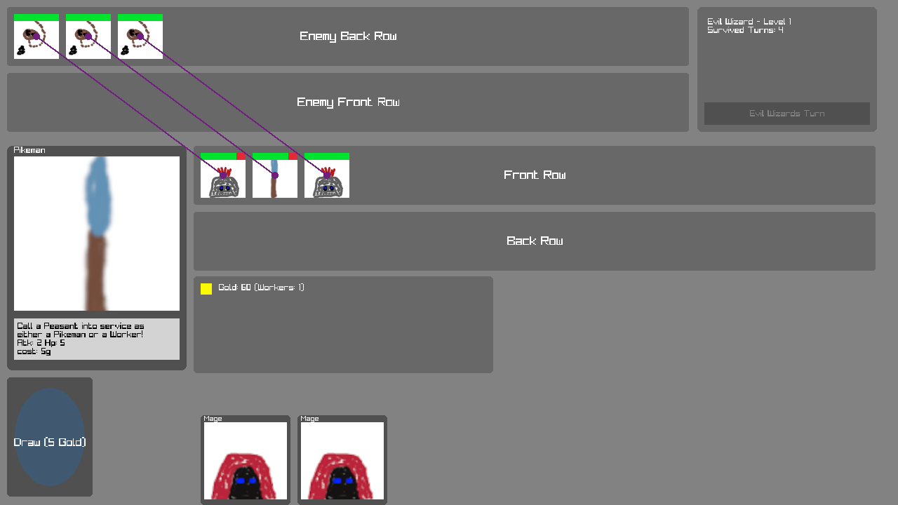

# Battle Cards

> A card game where your goal is to survive as many turns as possible. Manage your troops, draw cards, and spend gold wisely to stay alive.

Created for **Ludum Dare 50** (Compo) | Theme: *Delay the inevitable*

## Links

- [Game Page](https://wil.dev/gamejams/ld50-battle-cards/)
- [itch.io](https://wiltaylor.itch.io/battlecards)
- [Game Jam Entry](https://ldjam.com/events/ludum-dare/50/battle-cards)

## How to Play

You must keep troops in play each turn or you lose. Deploy peasants to earn gold, then use gold to draw cards and field stronger units. At the end of each turn, select which enemies you want your units to attack. Combat uses a two-row system:

- **Front row** - Melee units that deal damage to each other directly
- **Back row** - Ranged units that can only be attacked by other ranged units

If your front row is empty, back row units become vulnerable to direct attacks.

## Controls

| Input | Action |
|-------|--------|
| **[MOUSE]** Left Click | Select cards / Select enemy to attack / End turn |
| **[MOUSE]** Drag | Move card to play area |

## Details

| | |
|---|---|
| Engine | Custom |
| Language | C |
| Platforms | Web |
| Status | Submitted |

## Screenshots

## Licence

See [../../LICENCE.md](../../LICENCE.md).
