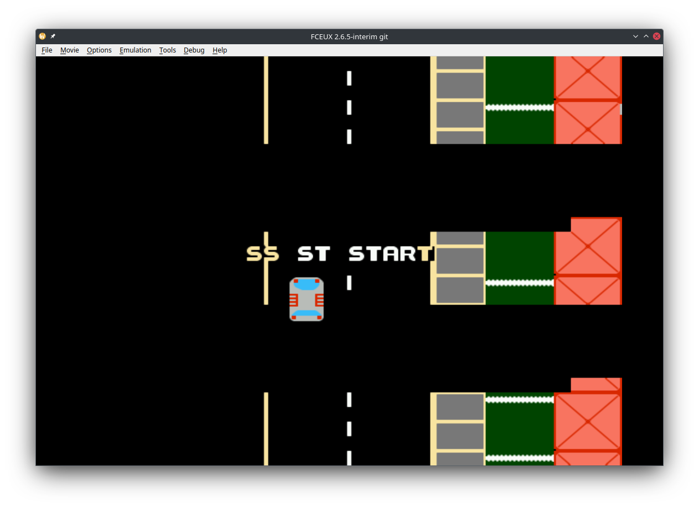

# Delivery

> A delivery driving game for the Nintendo Entertainment System. Duck and weave through traffic while launching packages at houses to meet your deadlines.

Created for **Ludum Dare 53** (Compo) | Theme: *Delivery*

> **What went wrong:** Ran into a lot of problems with memory corruption while building the game. I should have spent more time getting debugging working and learning more 6502 assembly techniques before attempting this. Doing a dry run before the jam would have been really helpful too.

## Links

- [Game Page](https://wil.dev/gamejams/ld53-nes-delivery/)

## How to Play

- Avoid crashing into other cars
- Deliver packages to houses designated with flashing rectangles
- Bonus points if you launch the package through the window
- The game keeps getting faster and trickier - try to get the highest score
- Download the ROM and play in your favourite NES emulator, or on real hardware with a flash cart

## Controls

| Input | Action |
|-------|--------|
| **[NES]** Left / Right | Steer left and right |
| **[NES]** Up | Accelerate |
| **[NES]** Down | Brake |
| **[NES]** A | Throw package Left |
| **[NES]** B | Throw package Right |
| **[NES]** Start | Pause |
| **[NES]** Select | Honk Horn in frustration |

## Details

| | |
|---|---|
| Engine | Custom |
| Language | 6502 Assembly |
| Platforms | NES |
| Status | Failed |

## Screenshots

## Licence

See [../../LICENCE.md](../../LICENCE.md).
